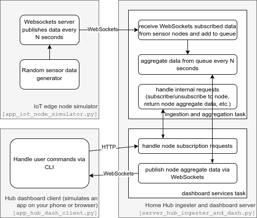

# A3a: Websockets-based Hub Dashboard Simulation of local IoT system

**NOTE:** you can view this Markdown (.md) file in the correct formatting using the "preview button" in the top-right corner in Visual Studio Code.  Read the whole document before you continue.

## Overview

Basically, this homework shows you the basics of a local (home) IoT
system, except everything runs locally on your computer since we have
not yet quite gotten to making the Bluetooth Low Energy edge node itself.
This system has three processes, one to simulate each component of
a local IoT system: an edge node process(es), a home hub process,
and finally, a user (your phone or computer) client process.  We do
not have the cloud portion in this simulation yet, but will add it
in the not-so-distant future.

## System block diagram

## Packages required

First, make sure to install:
1. `psutil` via Miniforge Prompt and the ee5450 env: `mamba install psutil` so that we can 
do the scans for "service discovery".  
1. `aioconsole` via Miniforge Prompt and the ee5450 env: `mamba install aioconsole` so that we can easily combine asyncio with user input
1. Insomnia via: https://insomnia.rest/download

Normally you'd use bleak or whatever Bluetooth Low Energy service 
discovery tool, but since we haven't quite yet gotten to that yet, 
we'll use `psutil` to discover services on our own computer.  The 
simulator below will run different services that provide sensor data 
on different TCP ports above 8080 in order to simulate the discovery 
process.  The Hub ingester and dashboard work together to get data 
from the sensor nodes processed and displayed for the homeowner. This 
setup essentially allows us to simulate a whole local home IoT system 
on your computer.

Insomnia allows us to test HTTP and WebSockets services without having
to keep refreshing on the web browser.  You could also just use `aiohttp`
directly with Python unit tests as well, but it's nice to have some 
exposure to simpler tools that require less work on your end.  Of course,
if you were working in industry and trying to make a reliable system
instead of just trying to finish your homework in a couple of weeks

## Your Tasks

It is up to you to create the command-line interface to the Home Hub services, 
the Home Hub dashboard client (`app_hub_dash_client.py`), so that it is easy 
for a user to issue the following commands:
1. Discover edge nodes
1. Subscribe to an edge node
1. Unsubscribe from an edge node
1. List all currently subscribed edge nodes
1. Display the values from the last five aggregations from the Hub
1. Quit the client (disconnect from the hub)

You should be using aiohttp's Client capabilities (both HTTP and WebSockets) so that your client can keep
receiving data while simultaneously waiting for user commands.

**NOTE:** your interface will need to be multitasked using asyncio.  
The built-in `input()` function is not a coroutine -- it is blocking.
Thus, you must use the `async_input()` coroutine I've already added to `app_hub_dash_client.py`,
which shows how it should be used.

## Running the IoT simulation system
### Executing each program using Visual Studio Code

To run the IoT simulation system, you will need to open three different terminal windows.  
You can click the + icon in the Terminal window in Visual Studio Code to open additional 
terminals in your workspace.  You will see three terminals appear in the right side of the
Terminal pane at the bottom half of your screen.  In each one, make sure the ee5450 environment
is activated by looking for (ee5450) on the left of the command prompt.

If the `mamba activate ee5450` command fails, you just need to run `conda init` with the
Miniforge Prompt window, then "trash" all of the terminals.  You will likely need to 
enable setup scripts by running `Set-ExecutionPolicy -Scope CurrentUser RemoteSigned`.

### Testing the HTTP functions using Insomnia

### Testing the WebSockets functions using Insomnia

In Insomnia, you can test the IoT node simulator by making a new WebSocket request 
and using the URL format: `ws://localhost:8090/data`, where you can replace 8090 with
8091, 8092, etc. to test a specific node between 8090 and 8099 (the program simulates 
9 nodes by default).
